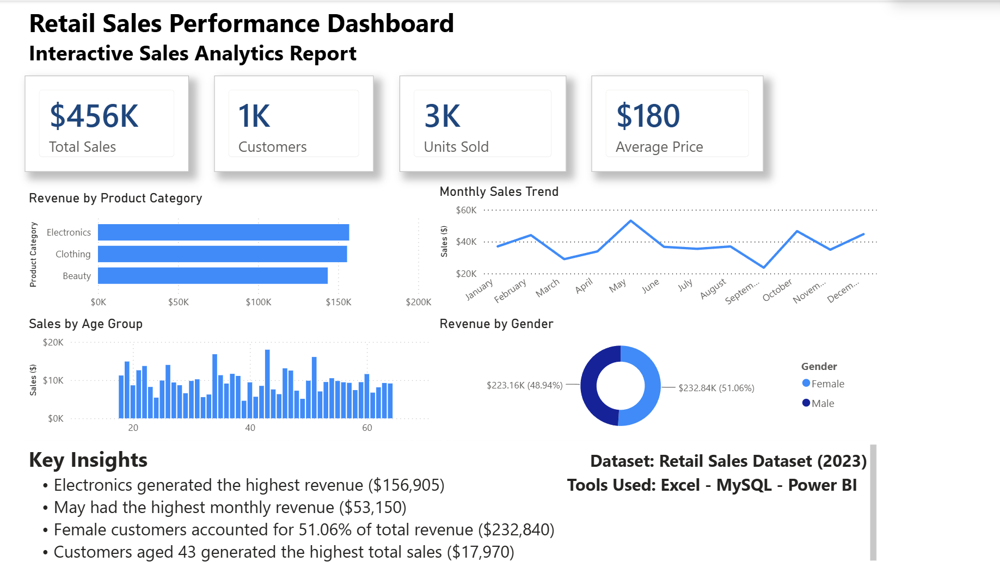

# 📊 Retail Sales Performance Dashboard

## Project Overview

This Project gives a summary of an end-to-end retail analysis using **Excel, MySQL, and Power BI**.
The objective was to analyze customer purchasing behavior, product performance, and sales trends while building an business style dashboard

---

## Dashboard Preview

---

## Tools Used

- Microsoft Excel
- MySQL
- Power BI

---

## Skills Demonstrated

- Data Cleaning
- PivotTables & PivotCharts
- SQL Queries
- Aggregations (`SUM`, `COUNT`, `AVG`)
- GROUP BY
- ORDER BY
- Subqueries
- KPI Reporting
- Dashboard Design
- Data Visualization

---

## Key Business Questions

- What were the total sales?
- Which product category generated the highest revenue?
- Which month had the highest sales?
- Which customer demographics generated the most revenue?
- Which age group spent the most?

---

## Structure

- **Data** - Original Dataset
- **Excel** - PivotTables and PivotCharts
- **SQL** - SQL analysis and business queries
- **Power BI** - Interactive dashboard (.pbix)
- **Images** - Dashboard and project screenshots

